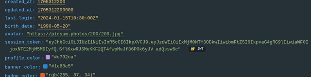
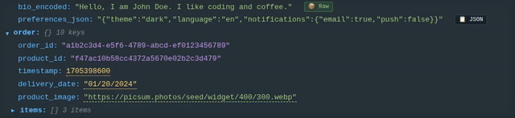
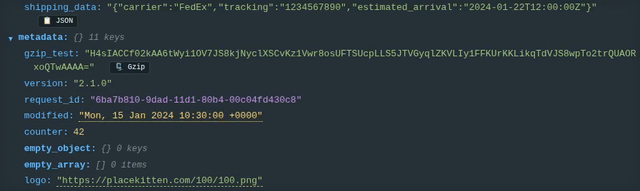
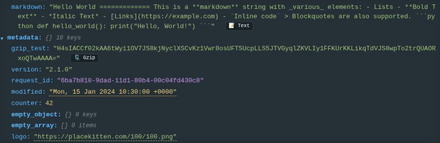
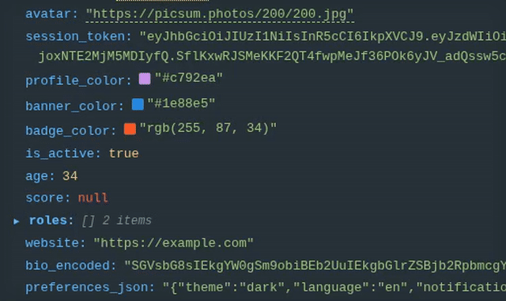
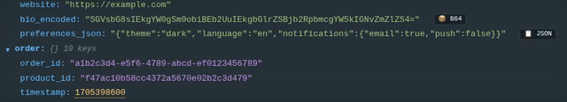
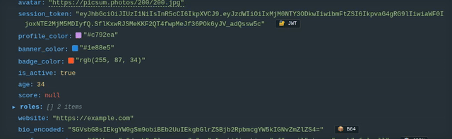

# JSON Tree Viewer

A lightning-fast, interactive visualizer for JSON files right inside VS Code. Stop squinting at raw brackets and start navigating your data with a collapsible tree UI, smart value detection, and custom coloring.

## Why use this?

Raw JSON gets unreadable quickly. We built this extension to fix that by automatically detecting, highlighting, and visualizing common data patterns directly in your editor:

- **Interactive Trees**: Expand and collapse huge JSON structures instantly without lag.
- **Smart Datetime Parsing**: Hover over any timestamp (Unix epochs, ISO strings) to see Local, UTC, and Relative time conversions instantly.
  
- **Nested JSON & Decoding**: Automatically decode nested JSON strings and Base64 content directly in the tree.
  
- **Decompression**: Seamlessly decompress Gzip/Zlib data for easy inspection.
  
- **Markdown Rendering**: JSON containing markdown? It's automatically rendered inline for readability.
  

## Additional Features

### Image Previews

_Automatically preview images from URLs or Base64 data._

### Base64 Support

_Instantly decode Base64 strings to view their underlying content in place._

### JWT Visualizer

_Define custom rules to highlight and identify JWT tokens or other patterns._

## Quick Start

1. Open any `.json` file in VS Code.
2. Click the tiny **Tree Icon** in the top-right editor action bar.
3. _Alternatively_: Highlight a snippet of JSON text, right-click, and select **"Open Selection in JSON Tree"**.

## Customization

The viewer is highly customizable via your VS Code `settings.json` (under `jsontree.*`):

| Setting                     | What it does                                   | Default   |
| --------------------------- | ---------------------------------------------- | --------- |
| `jsontree.uuid.enabled`     | Turns on UUID tracking.                        | `true`    |
| `jsontree.uuid.color`       | Highlight color for UUIDs.                     | `#c792ea` |
| `jsontree.datetime.enabled` | Turns on Datetime detection / hover tooltips.  | `true`    |
| `jsontree.datetime.color`   | Highlight color for timestamps.                | `#ffcb6b` |
| `jsontree.customRules`      | Supply your own Regex pattern matching arrays! | `[]`      |

## License

Apache-2.0
